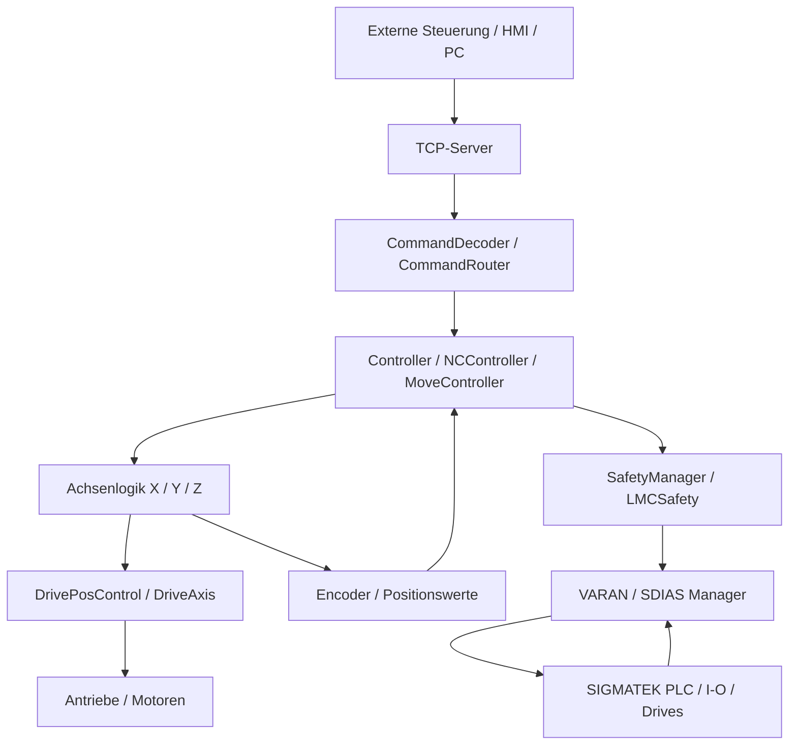

# Dokumentation: LASAL-Projekt fuer SIGMATEK-PLC

Stand: 17.07.2026

## 1. Kurzfazit

Das Verzeichnis `C:\tmp\LSLCL2\LASAL` enthaelt ein vollstaendiges LASAL-Projekt fuer eine SIGMATEK-PLC. Aus Code, Netzwerknamen und Git-Historie ergibt sich, dass es sich sehr wahrscheinlich um eine Bewegungs- bzw. Pick-and-Place-Maschine mit mehreren Achsen handelt.

Die Maschine nimmt Kommandos ueber TCP entgegen, dekodiert diese, steuert X-/Y-/Z-Achsen und bindet Antriebe, Encoder, Safety-Funktionen sowie SIGMATEK-Hardware ueber VARAN und SDIAS ein.

Eine exakte oeffentliche Maschinenbezeichnung wurde online nicht eindeutig gefunden. Die staerkste externe Spur ist die Webseite von R Weekers Techniek, auf der eine umgebaute Pick-and-Place-Maschine zum Verpacken von Saecken mit geriebenem Kaese in Kartons beschrieben wird. Diese Spur passt zu den Begriffen `PickPlace`, X/Y/Z-Achsen, Motion Control und der Git-Historie mit Rogier Weekers, ist aber kein endgueltiger Beweis.

## 2. Projektidentifikation

- Projektpfad: `C:\tmp\LSLCL2\LASAL`
- Projektdatei: `LASAL.lcp`
- Projektname: `LASAL`
- Plattform: SIGMATEK LASAL CLASS / PLC
- Programmiersprache: Structured Text (`.st`) mit C/C++-Anteilen
- Lizenz: MIT
- Git-Remote: `https://github.com/Fontys-PPM/LASAL.git`
- Git-Branch: `master`
- Letzter bekannter Commit: `edd1e91`

README-Inhalt:

```text
# LASAL
The LASAL code for the Sigmatek PLC.
```

## 3. Vermutete Maschinenfunktion

Die Software wirkt wie die Steuerung einer automatisierten Pick-and-Place- oder Handling-Maschine.

Wahrscheinlicher Ablauf:

1. Eine externe Steuerung, ein PC oder ein HMI sendet Kommandos per TCP.
2. Der TCP-Server nimmt die Daten entgegen.
3. Ein Command-Decoder bzw. Router interpretiert die Befehle.
4. Controller- und NC-Controller-Logik erzeugen Bewegungsablaeufe.
5. Achsobjekte steuern X-, Y- und Z-Bewegungen.
6. Drive- und Positionsregler geben Sollwerte an Antriebe weiter.
7. Encoder und Sensorwerte liefern Rueckmeldungen.
8. Safety- und Hardwaremanager ueberwachen Fehler, Limits, Not-Aus und Bus-Kommunikation.

## 4. Blockschema



## 5. Projektstruktur

### Root-Dateien

- `LASAL.lcp`: Hauptprojektdatei, XML-basiert, enthaelt Projekt- und Online-Verbindungsdaten.
- `LASAL.lcb`: LASAL-Projekt-/Builddatei.
- `MaeExp.xml` / `MaeExp.txt`: Exportierte Projekt-/Maschinendaten.
- `MultiMasterExp.mme`: Multi-Master-/Maschinenmanager-Konfiguration.
- `README.md`: Sehr kurze Projektbeschreibung.
- `LICENSE`: MIT-Lizenz.

### Wichtige Ordner

- `Class`: Zentrale PLC-Klassen und Maschinenlogik.
- `Network`: LASAL-Netzwerke, z.B. `XAxis`, `PickPlace`, `TcpServer`, `HW_Network`.
- `Drive`: Antriebsparameter und Drive-Konfigurationen.
- `Include`: Globale Header, Typen und Kanaldefinitionen.
- `Source`: Basiscode und Schnittstellen zu SIGMATEK-Systemfunktionen.
- `ProjectInternal`: Interne LASAL-/IDE-Daten.

## 6. Zentrale Softwaremodule

### Kommunikation

Relevante Klassen und Netzwerke:

- `_TCPIP_SERVER`
- `CommandServer`
- `CommandDecoder`
- `CommandRouter`
- `Network\TcpServer`

Aufgabe: Empfang und Verarbeitung externer Befehle. Die Git-Historie weist darauf hin, dass die Befehlsstruktur spaeter an eine Dokumentation angepasst wurde.

### Bewegungssteuerung

Relevante Klassen:

- `Controller`
- `NCController`
- `MoveController`
- `_LMCAxis`
- `_LMCAxisBase`
- `_DriveAxis`
- `_DriveAxisBase`
- `DrivePosControl`
- `PosController`

Aufgabe: Homing, absolute Positionierung, Achsbewegungen und Positionsregelung. In der Git-Historie werden X-/Y-Achsen-Homing, absolute Positionsbewegung und spaeter Z-Achsenbewegung erwaehnt.

### Hardware- und Bus-Anbindung

Relevante Klassen:

- `VaranManager`
- `VaranManager_Base`
- `SdiasManager`
- `SdiasBase`
- `HwControl`
- `HwBase`
- `HwBaseCDIAS`
- `BusInterfaceSDIASInternal`

Aufgabe: Verbindung zur SIGMATEK-Hardware, VARAN-Bus, SDIAS-Module, Hardwarebaum und I/O-Verwaltung.

### Safety

Relevante Klassen:

- `SafetyManager`
- `SafetyCDIAS_Base`
- `SafetyUDP`
- `_LMCSafety`

Aufgabe: Safety-Kommunikation, sichere Module, Not-Aus-/Limit-/Fehlerzustaende und Safety-Diagnose.

### Antriebe und Achsparameter

Relevante Ordner und Dateien:

- `Drive\*_dc062_48Vdc.*`
- `Drive\lineair_y_axis_4.*`
- `_DriveMngBase`
- `_DriveMng_DC062`

Aufgabe: Drive-Konfigurationen, Parameter, Motorausgangsstufen und Achszuordnung.

## 7. Online-Verbindung aus Projektdatei

In `LASAL.lcp` ist eine Online-Verbindung eingetragen:

```text
ConfigName="ppm"
IP="10.101.10.150"
PORT="1954"
Password=""
SSLTLS="0"
```

Bewertung:

- Die IP ist eine private Netzwerkadresse.
- Das Passwortfeld ist leer.
- SSL/TLS ist laut Projektdatei deaktiviert.
- Diese Angaben sind typisch fuer eine lokale Inbetriebnahme- oder Laborumgebung, sollten aber vor realem Anlagenbetrieb sicherheitstechnisch geprueft werden.

## 8. Hinweise aus Git-Historie

Die letzten bekannten Commits zeigen:

- `edd1e91`: Z-Achsenbewegung wurde programmiert, State Machine und Befehlsstruktur wurden aktualisiert.
- `23d8f49`: ACK wurde in einen Zustand integriert.
- `c373f90`: State Machine geaendert, Dokumentation entsprechend angepasst.
- `ba513e2`: X- und Y-Achsen-Homing sowie absolute Positionsbewegung; Hinweis auf Bug in Netzwerkuebertragung bzw. ASCII-zu-Integer-Konvertierung.

Wichtig: Aus der Historie ist nicht sicher ableitbar, ob der ASCII-zu-Integer-Bug spaeter vollstaendig behoben wurde. Das sollte gezielt im TCP-/Command-Code geprueft werden.

## 9. Internet-Recherche

Gefundene oeffentliche Quellen:

- GitHub-Repo: `https://github.com/Fontys-PPM/LASAL`
- SIGMATEK LASAL Engineering Tool: `https://www.sigmatek-automation.com/en/products/engineering-tool-lasal/`
- R Weekers Techniek: `https://weekers.nl/`

Bewertung:

- Das GitHub-Repo bestaetigt, dass es LASAL-Code fuer eine SIGMATEK-PLC ist.
- SIGMATEK bestaetigt LASAL als Engineering-Plattform fuer PLC, Motion, Safety, Visualisierung und Maschinenautomatisierung.
- Weekers beschreibt online mehrere Maschinenbauprojekte, darunter eine Pick-and-Place-Maschine zum Verpacken von Saecken mit geriebenem Kaese in Kartons. Das passt gut zum Code, ist aber nur ein Indiz.

## 10. Risiken und offene Punkte

- Keine eindeutige oeffentliche Maschinenidentifikation gefunden.
- Safety-relevante Logik darf nicht ohne fachliche Validierung geaendert werden.
- Online-Verbindung ohne Passwort und ohne TLS sollte bei realem Anlagenzugriff bewertet werden.
- Generierte Dateien (`.lba`, `.lob`, `.lcb`) sollten nur mit LASAL-Werkzeugen veraendert werden.
- Der in der Git-Historie erwaehnte Netzwerk-/ASCII-Konvertierungsfehler sollte bei Wiederinbetriebnahme geprueft werden.

## 11. Gesamtfazit

Das Projekt ist eine industrielle PLC-Steuerung fuer eine SIGMATEK-basierte Bewegungsmaschine. Die Architektur kombiniert TCP-Kommunikation, Befehlsdekodierung, Zustandsmaschine, Motion-Control, Achsregelung, Drive-Konfiguration, Encoder-Rueckmeldung, Safety und VARAN-/SDIAS-Hardwareanbindung.

Die wahrscheinlichste Maschinenart ist eine Pick-and-Place- bzw. Verpackungsmaschine mit X-/Y-/Z-Achsen. Eine Verbindung zur von R Weekers Techniek beschriebenen Pick-and-Place-Verpackungsmaschine fuer geriebenen Kaese ist plausibel, aber aus den oeffentlichen Informationen nicht zweifelsfrei belegbar.
