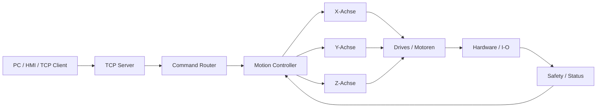
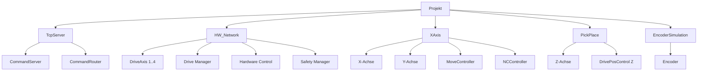

# Drei-Achsen-Projekt

Dieses Projekt beschreibt eine PLC-basierte Drei-Achsen-Steuerung mit TCP-Kommunikation, Bewegungslogik, Antriebsanbindung und Safety-/Hardwareueberwachung.

## Ziel

Das Ziel ist eine einfache Struktur fuer eine Maschine mit:

- X-Achse
- Y-Achse
- Z-Achse
- TCP-Kommandos von einem externen System
- Bewegungssteuerung ueber einen Motion Controller
- Drive- und Encoder-Anbindung
- Safety- und Hardwarestatus

## Grundidee

Ein externes System sendet ASCII-Kommandos ueber TCP. Die Steuerung nimmt diese Kommandos entgegen, dekodiert sie und leitet sie an die Bewegungslogik weiter. Die Bewegungslogik steuert die Achsen und ueberwacht Rueckmeldungen, Hardwarestatus und Safety-Zustaende.



## Hauptmodule

### TCP Server

Nimmt Kommandos von einem externen System entgegen.

Aufgaben:

- TCP-Verbindung bereitstellen
- empfangene Daten puffern
- Daten an den Command Router weitergeben
- Statusantworten senden

### Command Router

Interpretiert empfangene ASCII-Kommandos.

Aufgaben:

- Befehl erkennen
- Parameter auslesen
- Werte in Zahlen umwandeln
- passende Motion-Funktion aufrufen

### Motion Controller

Steuert den Bewegungsablauf der Achsen.

Aufgaben:

- Power on/off
- Homing
- absolute Bewegungen
- Zustandsmaschine
- Rueckmeldung an TCP Server

### Achsen

Das Projekt ist als Drei-Achsen-System gedacht:

- X-Achse: lineare Hauptachse
- Y-Achse: lineare Nebenachse
- Z-Achse: Hub-/Pick-Achse

### Drive- und Hardwaremodule

Aufgaben:

- Antriebsparameter verwalten
- Drive-Status lesen
- Positionen ausgeben
- Hardwarefehler melden
- I/O und Bus-Kommunikation bereitstellen

### Safety

Aufgaben:

- Not-Aus / Emergency ueberwachen
- Hardwarefehler auswerten
- Achslimits pruefen
- sichere Zustaende ermoeglichen

## TCP-Kommandos

Der TCP-Command-Port ist:

```text
1985
```

Unterstuetzte Kommandos:

```text
CPOWERON
CPOWEROF
CMOVEABS;XXXXXXXX;YYYYYYYY;PPPPPPPP
```

### CPOWERON

Schaltet die Achssteuerung ein.

```text
CPOWERON
```

### CPOWEROF

Schaltet die Achssteuerung aus.

```text
CPOWEROF
```

### CMOVEABS

Fuehrt eine absolute Bewegung aus.

Format:

```text
CMOVEABS;XXXXXXXX;YYYYYYYY;PPPPPPPP
```

Beispiel:

```text
CMOVEABS;00001000;00002000;00000000
```

Felder:

- `CMOVEABS`: Bewegungsbefehl
- `XXXXXXXX`: X-Position
- `YYYYYYYY`: Y-Position
- `PPPPPPPP`: Zusatzwert / Winkelwert

Die Werte sind als feste ASCII-Zahlenfelder ausgelegt.

## Beispiel: Kommando senden

Power einschalten:

```powershell
$client = [System.Net.Sockets.TcpClient]::new("10.101.10.150",1985)
$stream = $client.GetStream()
$msg = [Text.Encoding]::ASCII.GetBytes("CPOWERON")
$stream.Write($msg,0,$msg.Length)
$client.Close()
```

Absolute Bewegung senden:

```powershell
$client = [System.Net.Sockets.TcpClient]::new("10.101.10.150",1985)
$stream = $client.GetStream()
$msg = [Text.Encoding]::ASCII.GetBytes("CMOVEABS;00001000;00002000;00000000")
$stream.Write($msg,0,$msg.Length)
$client.Close()
```

## Projektstruktur

```text
LASAL.lcp
├─ HeaderFiles
├─ ClassFiles
├─ NetworkFiles
├─ DriveFiles
└─ DocuFiles
```

Wichtige Netzwerke:

```text
TcpServer
HW_Network
XAxis
EncoderSimulation
PickPlace
```

Wichtige Klassen:

```text
CommandServer
CommandRouter
MoveController
NCController
DrivePosControl
Encoders
SafetyManager
HwControl
```

## Projektmodule



## Teststrategie

Empfohlene Reihenfolge:

1. Projekt offline oeffnen.
2. Build/Check ausfuehren.
3. Fehlende Libraries oder Systemdateien klaeren.
4. TCP Server isoliert testen.
5. `CPOWERON` ohne Bewegung testen.
6. Kleine `CMOVEABS`-Werte senden.
7. Rueckmeldung und ACK pruefen.
8. Erst danach reale Achsbewegungen freigeben.

## Sicherheit

Dieses Projekt kann reale Motoren und Achsen bewegen.

Vor jedem Test:

- Maschine mechanisch sichern
- Not-Aus pruefen
- Safety aktivieren
- kleine Bewegungswerte verwenden
- Achsraum freihalten
- nur mit fachlicher Aufsicht testen

Kommandos wie:

```text
CPOWERON
CMOVEABS;...
```

koennen echte Bewegungen ausloesen.

## Hinweise

- Die Projektdatei ist fuer LASAL CLASS / CLASS 2 gedacht.
- Ohne passende Entwicklungsumgebung ist nur Quellcodeanalyse moeglich.
- Fuer echte Tests werden passende PLC-Hardware, passende Drives und korrekte Safety-Konfiguration benoetigt.
- Einige Dateien koennen ISO-8859-1 oder Windows-1252 codiert sein.

## Begleitdateien

Zusaetzlich koennen folgende Dateien fuer die Analyse genutzt werden:

```text
project_modules.html
lasal_blocks.html
lasal_viewer.html
LASAL_POC_Dokumentation_DE.pdf
```

## Status

Dies ist ein POC-/Analyseprojekt fuer eine Drei-Achsen-Steuerung mit TCP-Anbindung.
